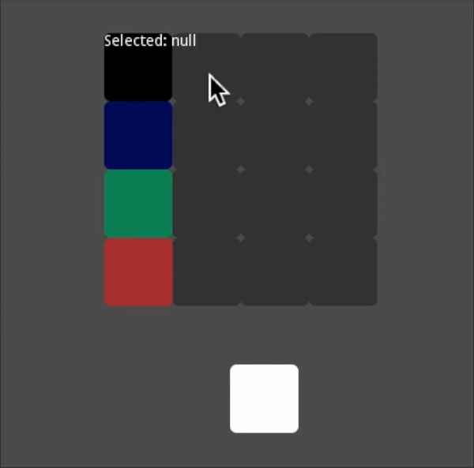
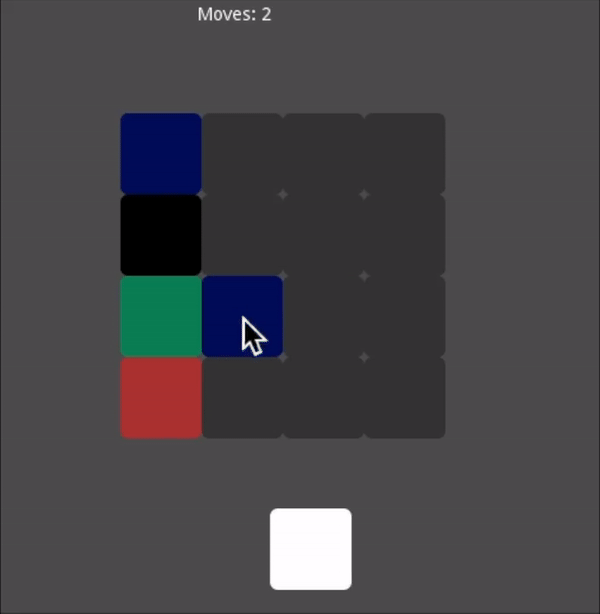
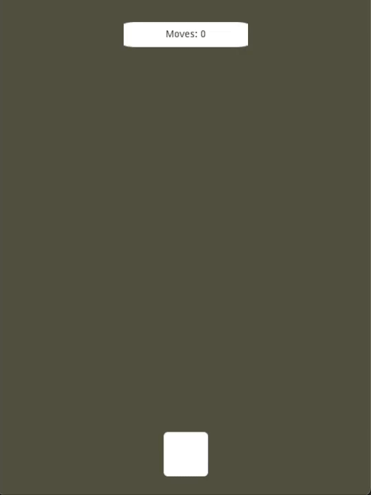

# NewbiesJamMyGame

My first game jam ever!
A simple puzzle game made for [Newbies Game Jam (2022 - 1)](https://itch.io/jam/newbies) with MINIMALISM theme!

## Objective

## My goals

​First game jam ever and third "complete" I game ever published! This time my goals are focused on time management and deadline stuff.  I will not try to tackle too many completely new stuff. After the voting deadline maybe I will do some much-needed code refactoring and maybe some game updates/expansion.

## Progress Updates:

### 18/04/22:

* Created project repository
* Create base scenes: `Block`, `Grid`, `Main` and `GameUI`
* Created base block mechanics: select block, swap two adjoint blocks 
* Created grid generation: creates the grid as a matrix and select corrisponding color from a random list of `colorId` -> if grid is a NxM matrix (rows and columns), there will be N different color; column with index 0 is fixed, always showned and as N unique color; columns with indexes 1 to M are hidden, in these there are a total of M-1 blocks with a specific color
* Created a `RestartButton`: re-randomize the grid
* Created a `Globals` script containing: `RandomManager` struct, some to be filled `enums`, `ColorPalette` static class

### 19/04/22:

The code is already a mess... `Grid.cs` is the most chaotic scripts ever... too many edge-cases, too many async/await, state machine not utilized enough, too many if, too many row of code in a single file... as now, I'm good with this delirious mess... it works... I will refactor in the future, maybe post jam! 

* Completed base game-mechanics (at least a solid base), the mess in `Grid.cs` I talked about:  movements, win-condition, edge-cases, valid-movement-condition, collapsing, check if same color
* Created connection between `Grid` and `GameUI` to update moves counter
* Added `GRIDSTATE`: basically IDLE versus `Tween`/`Timer` activating
* Some game balancing: supermoves (click one and then swap after one color is shown) count 2 moves

### 20/04/22:

Now the game is quite solid respect different screen size and orientation (portrait for mobile).
Mechanichs and structure of the core part of the game is done. Now I can focus on graphics, main theme, UI structure, possible menus type, more complex animation/tween and also balancing-difficulty, possible game mode (moves count mode, timed mode, different level, increasing number of color/columns, specific challenges).

* Added adjustable `_cellBorder` paramater
* Now compatible with every number of color and column (every NxM grid)
* Now compatible with mobile/touch device, tested on Android
* Now adative to multiple screen size: on mobile is portrait and `Grid` is rotate 90 degrees; blocks size auto-change to fill screen size (constrainted by some borders) 
* `Grid` now as a separete `CanvasLayer` and `Control` node: can control anchors, programmatically placed in the middle
* Shifted the `Grid` center to be in the middle of the grid itself -> programmatically calculates this offset and setup all the paramaters that depends on that;  now is easier to rotate the grid 
* Added some function `Init` to have more control to `Grid` initialization in `Main` 

### 23/04/22

Change my mind a few times meanwhile...totally abstract or not? I tried a themed base solution (a stylized building, blocks are windows, and select/match colors corresponds to turning on/off light), but I changed my mind and decided to go fully abstract that closer to what my actual style should (once renormalized my incompetence).

* Begin to create itch.io page (now draft state)
* Changes some core mechanics of the game: now matching color blocks don't disappear and blocks don't collapse, instead they become inactive and remain in the grid. This block can be moved/swapped with active blocks.  
* Refactored a lot of `Grid` code: still a mess but at least I can read it without throwing up
* Changed `Grid` creation and initialization: now it easier to modify things and keep track of row-column-xAxis-yAxis-arrayOrder relationship
* In `Globals` added a `Utilities` static class and a `GridInfo` static class
* Refactored input flow of `Grid` using more blocks and grid state and less await/async
* Created `TweenManager` static class to handle all tweens setup and start/stop: in `Grid` can call specific methods of `TweenManager` (corrisponding to specific animation) that stacks tween setup function (mainly interpolate). Then in `Grid` can call `TweenManager.Start(_tween, params Block[] blocks)`, this adds to tween setup a `InterpolateCallBack` to set blocks state back to `IDLE` when tween is finished (can be at different times for different block). This way a I can combine (using a delay time param) what ever animation I want on whatever block I want.
* I DON'T KNOW IF THIS METHOD IS GOOD FOR PERFORMANCE, BUT AT LEAST IT WORKS...AT LEAST FOR NOW
* Now while a tween animation is running you can still play with all the blocks that are not running a animation
* Created tween animations: swapping, selecting, unselecting, inactivating/switch-off, appering of the grid